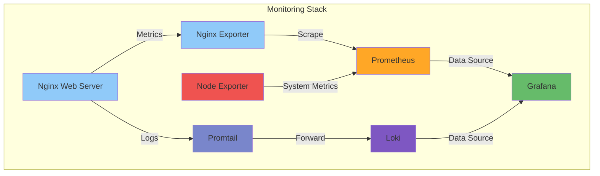
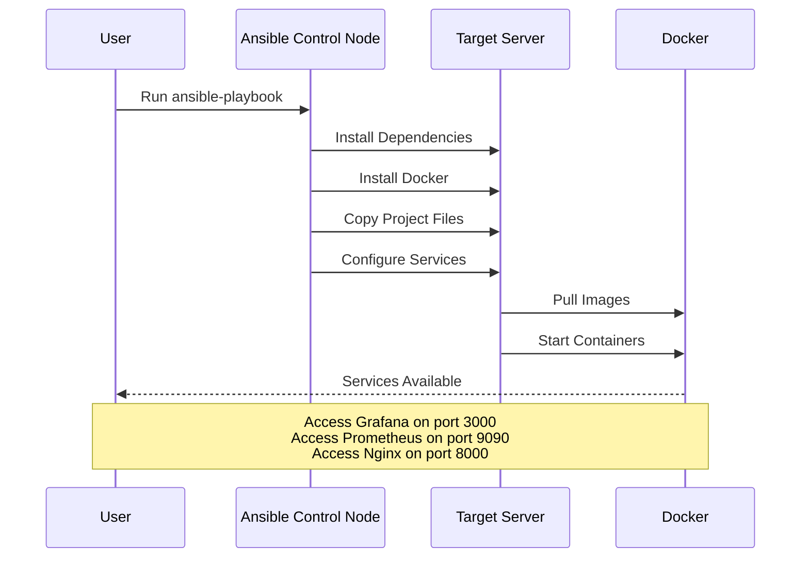

# Containerized Monitoring Lab

A comprehensive monitoring solution deployed via Ansible, providing a complete observability stack for containerized environments. This project serves as a learning lab for container monitoring, metrics collection, and log aggregation.

## 🎯 Overview

This project provides a containerized monitoring stack that includes:
- Metrics collection and visualization (Prometheus + Grafana)
- Log aggregation and search (Loki + Promtail)
- System metrics collection (Node Exporter)
- Web server metrics (Nginx + Nginx Exporter)

## 🏗️ Architecture



## 🚀 Deployment Process



## 📋 Prerequisites

- Ansible installed on the control node
- SSH access to target server
- Python installed on target server

## 🛠️ Deployment Instructions

1. Clone the repository:
```bash
git clone <repository_url>
cd <repository_name>
```

2. Configure your inventory in `ansible/inventory.yml`:
```yaml
all:
  hosts:
    monitoring:
      ansible_host: "your_server_ip"
      ansible_user: "your_ssh_user"
```

3. Deploy the stack:
```bash
cd ansible
ansible-playbook -i inventory.yml playbook.yml
```

The playbook will:
- Install Docker and its dependencies
- Create the project directory structure
- Copy all configuration files
- Configure all services
- Start the monitoring stack

## 📊 Monitoring Features

### Metrics Collection
- **Nginx Metrics**
  - Requests per second
  - Response time percentiles
  - Error rates (4xx/5xx)
  - Bandwidth usage
  - Requests by endpoint

- **System Metrics**
  - CPU usage
  - Memory utilization
  - Disk usage
  - Network traffic
  - System load

### Log Aggregation
- Nginx access logs
- Nginx error logs
- System logs
- Container logs

### Alerting
- High error rate detection
- Response time thresholds
- System resource alerts
- Service availability monitoring

## 🔐 Access Services

After deployment, the following services will be available:

| Service     | Port | Default Credentials |
|-------------|------|-------------------|
| Grafana     | 3000 | admin/admin      |
| Prometheus  | 9090 | N/A              |
| Nginx       | 8000 | N/A              |
| Node Exporter| 9100 | N/A              |

## 📈 Useful Queries

### Prometheus Queries
```promql
# Requests per second
rate(nginx_http_requests_total[5m])

# 95th percentile response time
nginx_http_response_time_seconds{quantile="0.95"}

# Error rate
sum(rate(nginx_http_requests_total{status=~"5.."}[5m]))

# CPU Usage
100 - (avg by(instance) (irate(node_cpu_seconds_total{mode="idle"}[5m])) * 100)
```

### Loki Queries
```logql
# Nginx error logs
{job="nginx-error"}

# Slow requests
{job="nginx-access"} | json | request_time > 1

# 5xx errors
{job="nginx-access"} | json | status >= 500
```

## 🔧 Maintenance

### Service Management
```bash
# Restart a specific service
docker-compose restart nginx
docker-compose restart grafana

# View service logs
docker-compose logs -f nginx
docker-compose logs -f prometheus

# Update services
docker-compose pull
docker-compose up -d
```

## 📁 Project Structure
```
.
├── ansible/                    # Ansible deployment configuration
├── docker-compose.yml         # Container orchestration
├── nginx/                     # Nginx configuration and static files
├── prometheus/                # Prometheus configuration and rules
├── grafana/                   # Grafana dashboards and provisioning
├── loki/                     # Loki configuration
└── promtail/                 # Promtail configuration
```
